# 🌱 Saple
[](https://github.com/mdraihankabirsifat/Saple/actions/workflows/ci.yml)

**Saple is a company and career insights platform that shows salaries, reviews, interview experiences and jobs together with how far each piece of information can be trusted.**

Saple is an independent BUET CSE academic project. It is not affiliated with, endorsed by, or an official login or careers service for any company it lists, and all people, salaries, reviews and vacancies in the demo data are synthetic.

## Application Preview

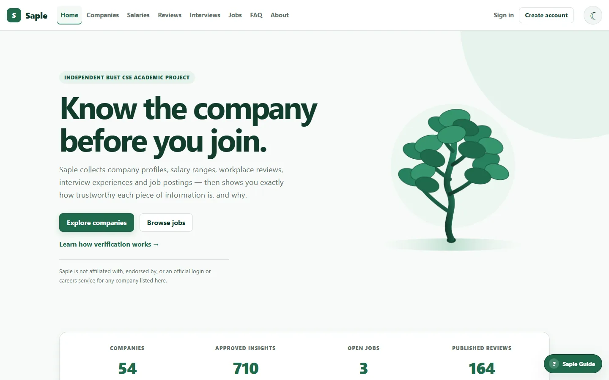

<table>
  <tr>
    <td width="50%" valign="top">
      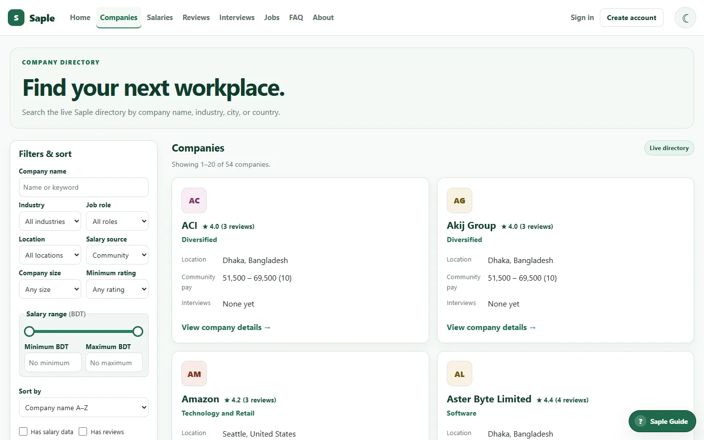
      <br><sub><b>Company directory</b>: search, filter and sort companies.</sub>
    </td>
    <td width="50%" valign="top">
      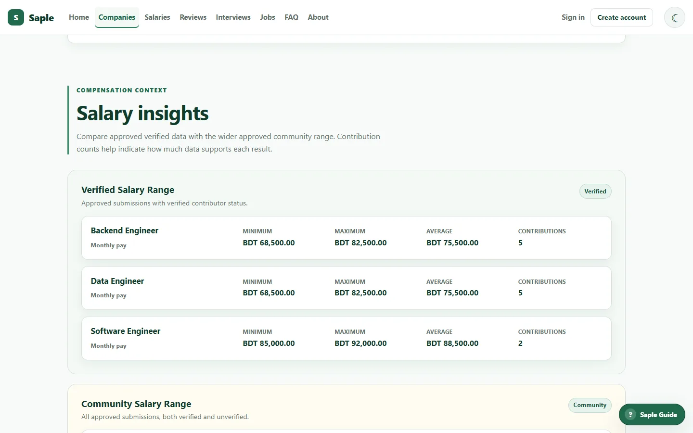
      <br><sub><b>Company profile</b>: verified and community salary ranges by role.</sub>
    </td>
  </tr>
  <tr>
    <td width="50%" valign="top">
      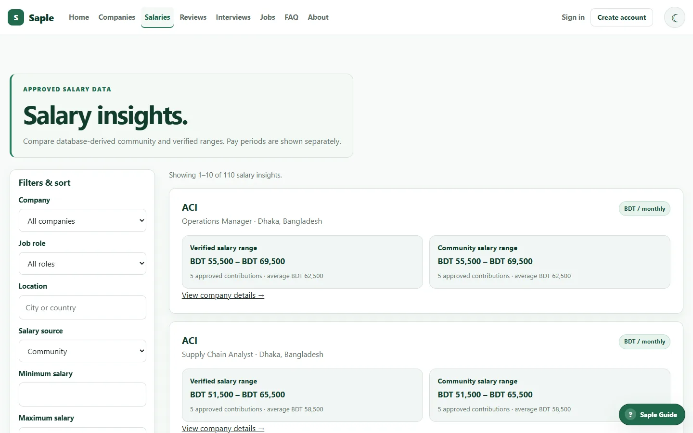
      <br><sub><b>Salary insights</b>: approved ranges across companies.</sub>
    </td>
    <td width="50%" valign="top">
      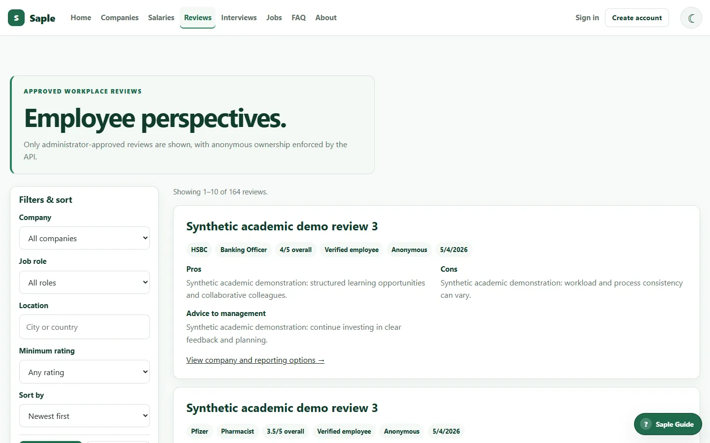
      <br><sub><b>Workplace reviews</b>: moderated, optionally anonymous.</sub>
    </td>
  </tr>
  <tr>
    <td width="50%" valign="top">
      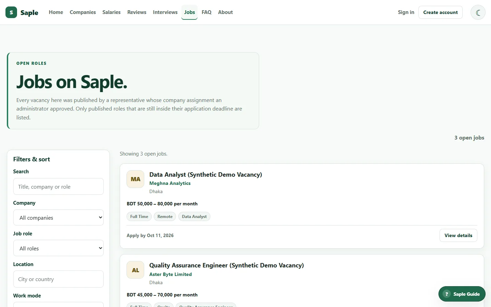
      <br><sub><b>Jobs</b>: published vacancies still inside their deadline.</sub>
    </td>
    <td width="50%" valign="top">
      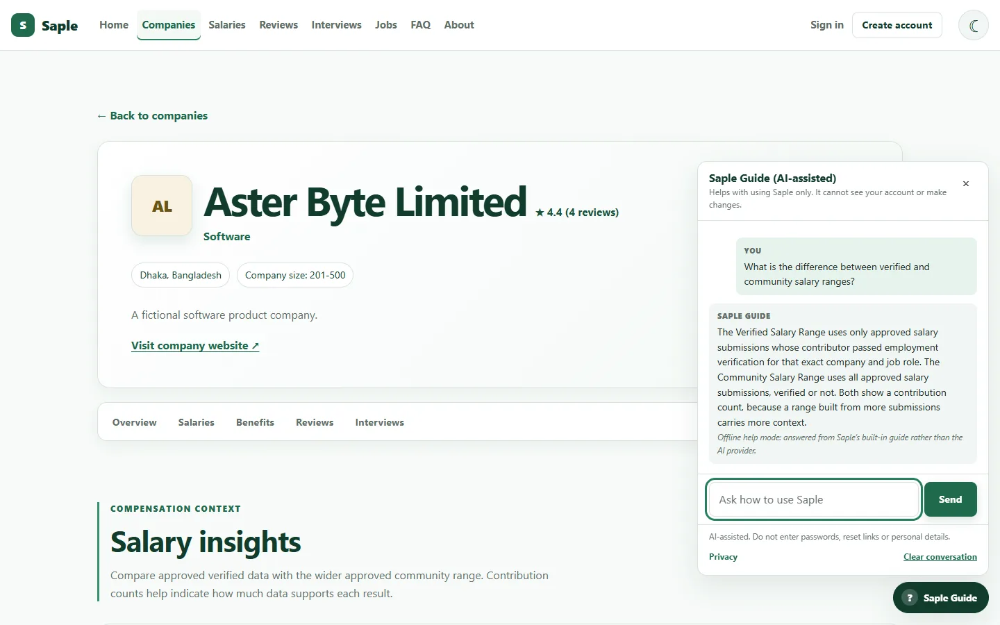
      <br><sub><b>Saple Guide</b>: help with using the site, with a built-in fallback.</sub>
    </td>
  </tr>
</table>

### Role-based Workspaces

<table>
  <tr>
    <td width="50%" valign="top">
      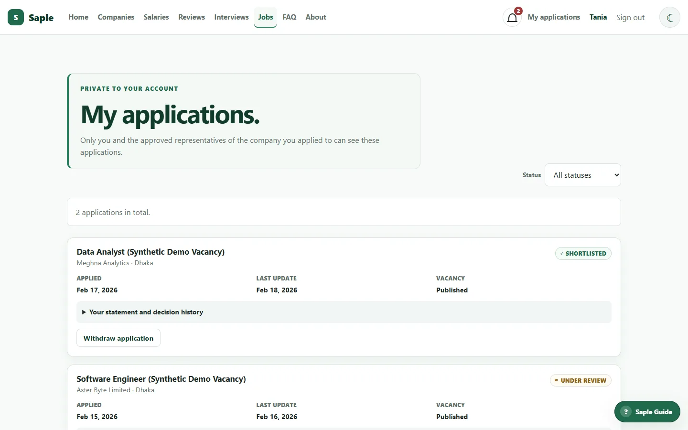
      <br><sub><b>Job seeker</b>: track and withdraw applications.</sub>
    </td>
    <td width="50%" valign="top">
      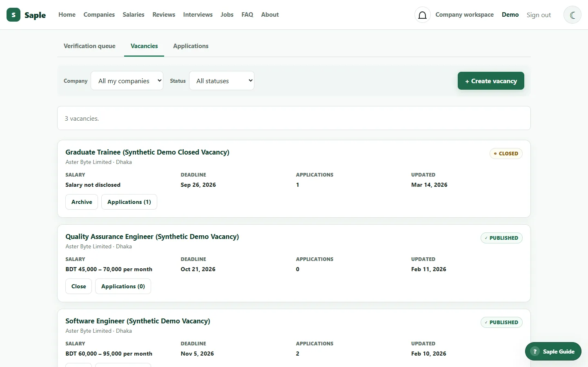
      <br><sub><b>Company representative</b>: vacancies, applications and verifications for assigned companies.</sub>
    </td>
  </tr>
  <tr>
    <td width="50%" valign="top">
      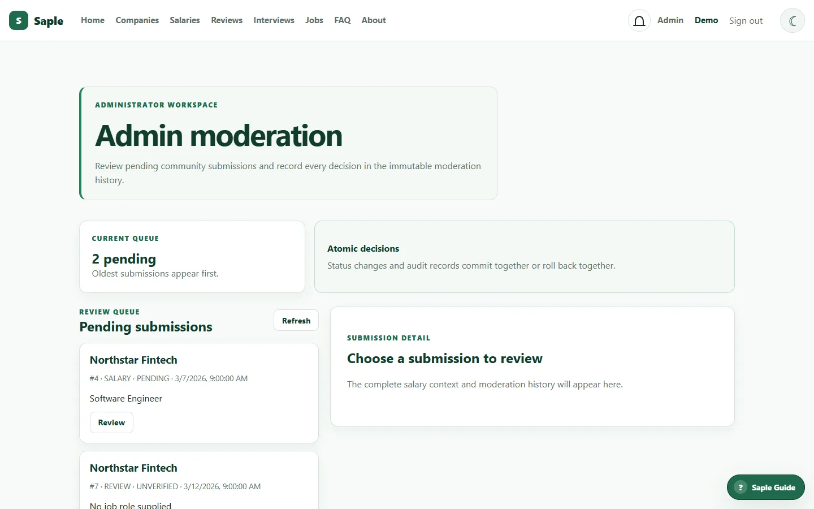
      <br><sub><b>Administrator</b>: moderation queue with an audited decision history.</sub>
    </td>
    <td width="50%" valign="top">
      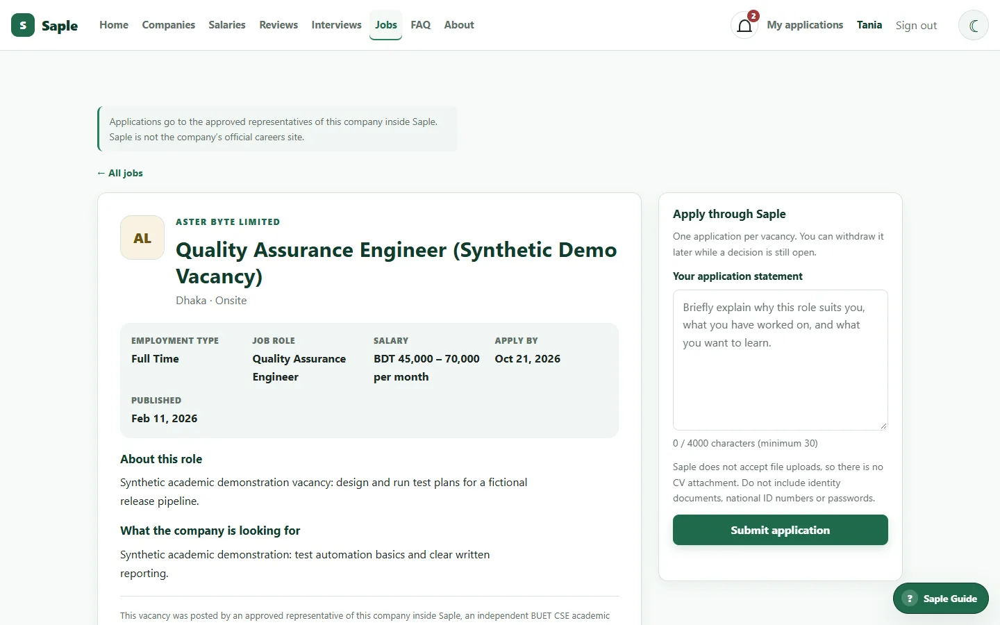
      <br><sub><b>Applying</b>: one statement per vacancy; no file uploads.</sub>
    </td>
  </tr>
</table>

More captures, including interview experiences, are in [`assets/screenshots/`](assets/screenshots/).

## What Saple Does

- **Company profiles** with benefits, ratings and every approved salary, review and interview for that company.
- **Two salary ranges**: a *Verified Salary Range* from contributors verified for that exact company and role, and a *Community Salary Range* from all approved salaries, each with its contribution count.
- **Moderated reviews and interview experiences**: nothing is public until an administrator approves it.
- **Jobs and applications**: company representatives publish vacancies; job seekers apply, track status and withdraw.
- **Employee verification** for a specific company and role, decided by that company's representative, with administrators as fallback.
- **Reports and moderation**: any signed-in user can report a contribution; administrators triage reports and record every decision.
- **Notifications and announcements** for decisions, application updates and site-wide notices.
- **Saple Guide** (AI): questions about using Saple go through Saple's own backend to an OpenAI-compatible provider. When no provider is configured, or it times out or rate-limits, the panel answers from a built-in knowledge base and labels that answer "Built-in Saple help (not AI)" rather than passing it off as the model.

## Roles and Trust Model

| Role | What it can do |
|------|----------------|
| **User** | Browse, apply to jobs, report content, request verification or a representative assignment. Registration always creates this role. |
| **Verified employee** | Contribute salaries, reviews and interviews, but only for the exact company and role they are verified for. |
| **Company representative** | Assigned by an administrator. Decides verification requests, manages vacancies and reviews applications for their own companies only. |
| **Administrator** | Moderates contributions, triages reports, approves or revokes representatives, publishes announcements and oversees jobs. |

Three rules hold throughout:

- **Approved-only publication.** Contributions start as pending and affect nothing public until approved.
- **Exact scope.** Verification for one company or role never implies another, and every request re-checks roles and scopes in the database, so a revocation applies on the next click.
- **Anonymous publicly, accountable internally.** Contributions can be shown without a name, while Saple keeps the internal link needed to investigate reports.

## Tech Stack

| Layer | Technology |
|-------|------------|
| Frontend | HTML, CSS and vanilla JavaScript modules; no build step, no third-party scripts |
| Backend | Node.js and Express 5 with raw parameterized SQL through `pg` |
| Database | PostgreSQL hosted on Supabase: 21 tables, 5 views, plus a timestamp trigger, a statistics function and a decision procedure |
| Auth and email | BCrypt password hashing, JSON Web Tokens, Nodemailer for the emailed password reset |
| AI (optional) | Any OpenAI-compatible chat endpoint for the Saple Guide; Groq's free tier is the documented default |
| Research prototype | A standalone Python ML experiment in [`ml/`](ml/), not wired into the app |

## Architecture

```text
Browser (static pages, strict Content-Security-Policy)
   │  same-origin HTTPS
   ▼
Express API  (routes → controllers → services → repositories)
   │  parameterized SQL, one transaction per multi-step write
   ▼
Supabase PostgreSQL
```

Supabase is used only as hosted PostgreSQL. The browser never connects to it directly and never receives database credentials, and authentication is handled by the Express backend, not Supabase Auth.

Work the database does itself: `saple_set_updated_at()` with one `BEFORE UPDATE`
trigger per table that has `updated_at`; `saple_company_insight_summary()`, which
computes a company's approved-only statistics; and
`saple_apply_application_decision()`, which applies one job-application decision
to `job_applications` and `job_application_status_history` together. Every runtime
write runs inside an explicit transaction. See
[`docs/cse216-final-compliance.md`](docs/cse216-final-compliance.md).

Security highlights:

- Every protected request reloads the account's status, role and company scopes from the database.
- Pages load no third-party code and run under a self-only Content-Security-Policy; dynamic text is rendered with `textContent`, never as HTML.
- Sign-in, recovery, reports, applications and the Saple Guide are rate-limited; reset links are single-use and stored only as hashes.
- A password is entered on three pages only: sign in, register, and the reset page reached through an emailed single-use link. No signed-in page asks for a password, and `PATCH /api/auth/me/password` no longer exists.
- Account, contribution and workspace pages are `noindex, nofollow` in both the HTML and the `X-Robots-Tag` header; the public directory stays indexable.

Details are in [`docs/security-and-safe-deployment.md`](docs/security-and-safe-deployment.md), and the current remediation status is in [`SECURITY_REMEDIATION_CHECKLIST.md`](SECURITY_REMEDIATION_CHECKLIST.md).

## Quick Start

You need Node.js 22 or newer and a PostgreSQL database, such as a Supabase project.

```bash
git clone https://github.com/mdraihankabirsifat/Saple.git
cd Saple/backend
npm ci
cp .env.example .env
npm start
```

Before `npm start`, set these values in `backend/.env`:

| Variable | Value |
|----------|-------|
| `DATABASE_URL` | Your PostgreSQL connection string (for Supabase, copy it from **Connect**; the Session pooler works on IPv4 networks) |
| `DB_SSL` | `true` for Supabase, `false` for a local server without TLS |
| `JWT_SECRET` | A long random secret |

Then open <http://localhost:3000>. Express serves both the pages and the API from that one origin. Without `DATABASE_URL`, the server refuses to start.

Keep secrets in `backend/.env` (ignored by Git) or in your host's private environment settings, and never commit them. Every other variable, including SMTP and AI settings, is listed in [`backend/.env.example`](backend/.env.example).

To create the schema, load the synthetic demo data, or upgrade an existing database, follow [`docs/supabase_setup.md`](docs/supabase_setup.md) and [`database/postgres/migrations/README.md`](database/postgres/migrations/README.md).

**Docker alternative:** with Docker Desktop running, `npm run local:up --prefix backend` (from the repository root) starts the app with its own seeded PostgreSQL. It needs no Supabase credentials, and `npm run local:accounts --prefix backend` prepares demo sign-ins.

## Tests

From `backend/`:

```bash
npm test                        # unit and HTTP tests; no database needed
npm run test:integration        # end-to-end workflows against a prepared database
npm run test:integration:jobs   # representatives, jobs, notifications, announcements
```

```bash
npm run verify:database        # read-only: checks tables, views, triggers, function, procedure
```

The two integration commands run against the database in `DATABASE_URL`, so point them at a test or local database, not production. `verify:database` only reads, and is safe against any database. The ML prototype has its own tests: `python -m unittest discover -s tests` from `ml/`. CI runs the unit suite on every push.

## Documentation

- [`ERD.pdf`](ERD.pdf) and [`docs/ERD.md`](docs/ERD.md): entity-relationship diagram, generated from the schema
- [`SECURITY_REMEDIATION_CHECKLIST.md`](SECURITY_REMEDIATION_CHECKLIST.md): what the code now enforces, and the manual steps only the owner can take
- [`docs/cse216-final-compliance.md`](docs/cse216-final-compliance.md): the CSE216 checklist mapped to code, database objects, tests and a demonstration
- [`docs/relational_schema.md`](docs/relational_schema.md): tables, constraints and status transitions
- [`docs/supabase_setup.md`](docs/supabase_setup.md): database setup and migrations
- [`docs/deployment.md`](docs/deployment.md): Supabase connection and Render hosting
- [`docs/security-and-safe-deployment.md`](docs/security-and-safe-deployment.md): security controls and a safe deployment checklist
- [`docs/ai-assistant-setup.md`](docs/ai-assistant-setup.md): Saple Guide provider configuration
- [`docs/email-setup-and-test.md`](docs/email-setup-and-test.md): SMTP setup for password recovery
- [`backend/README.md`](backend/README.md) and [`frontend/README.md`](frontend/README.md): API contracts and frontend structure

## Project Status

The application, schema, migrations, tests and documentation are complete for this project phase. Saple is **not currently deployed**. Hosting, email delivery and the AI provider each depend on private configuration supplied by the owner.

## License / Academic Notice

This repository does not include an open-source license. Saple is an independent BUET CSE academic project and is not an official service of any company it lists.
