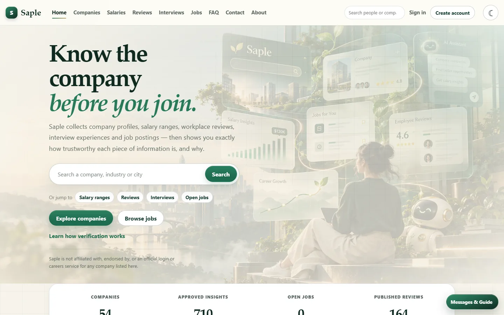
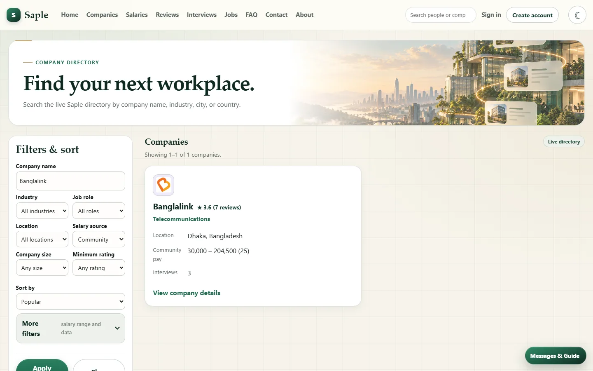
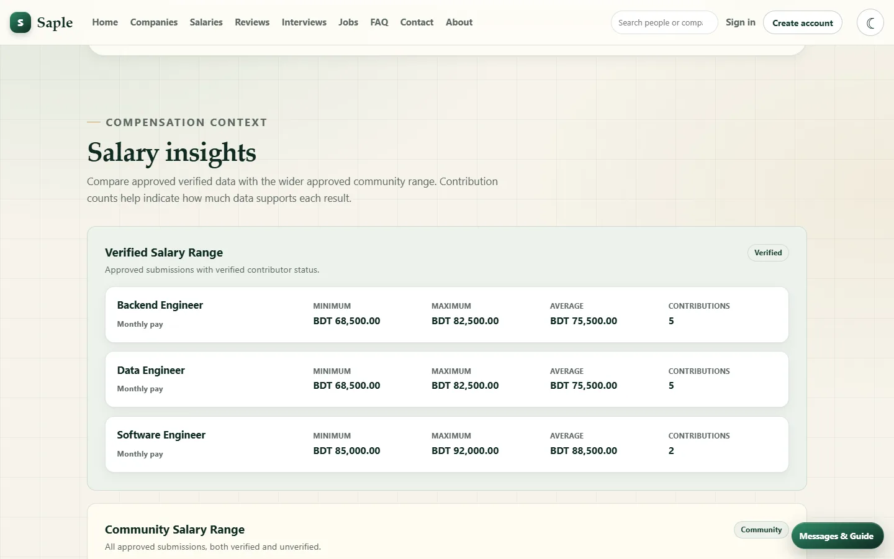
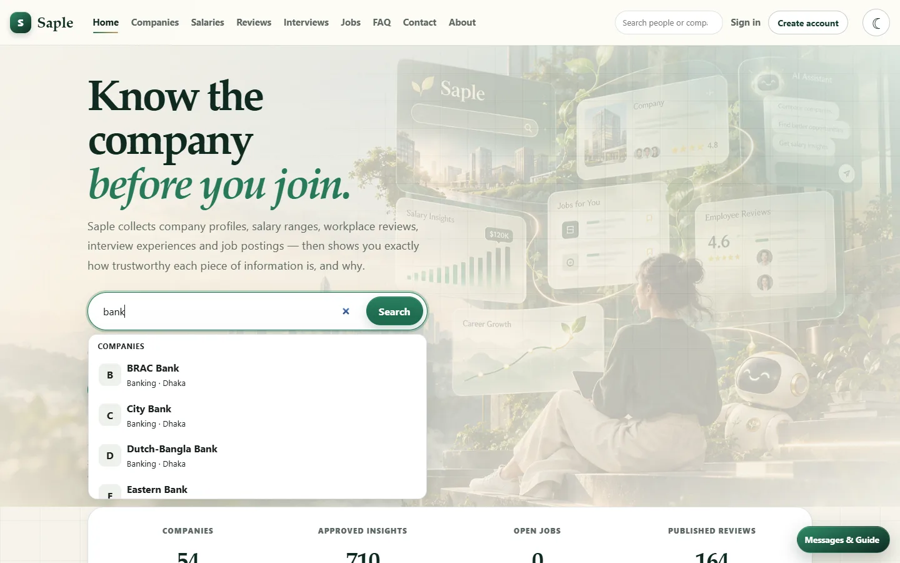
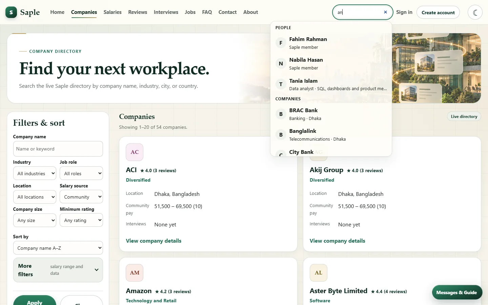
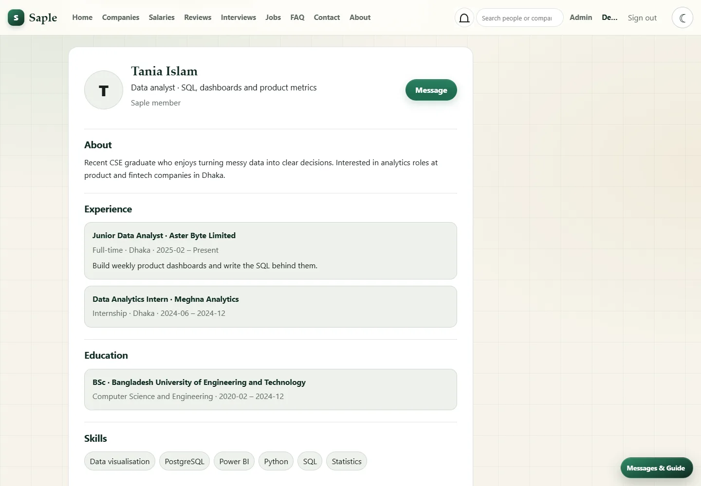
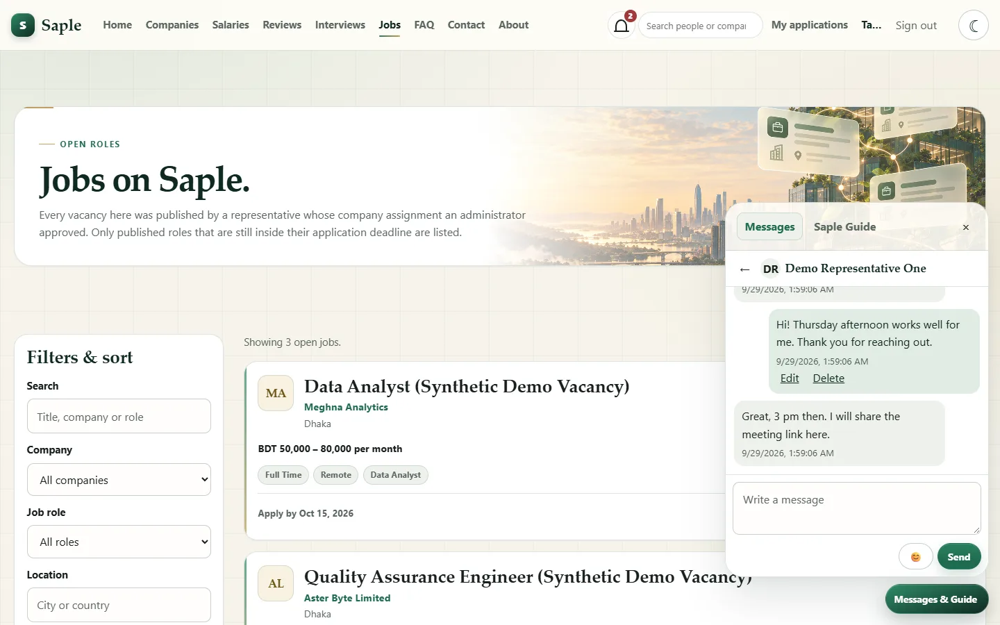
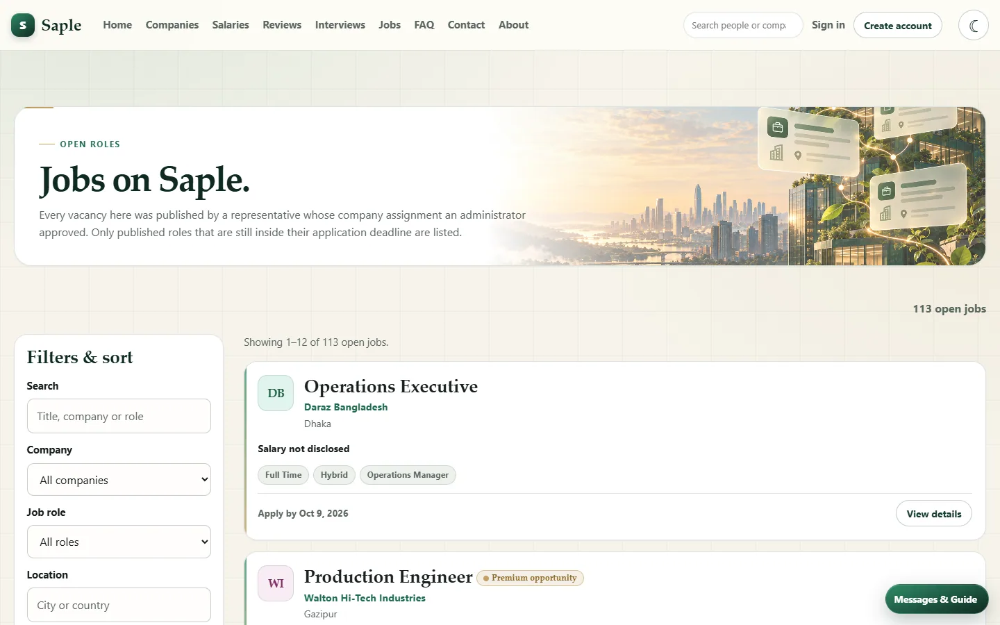
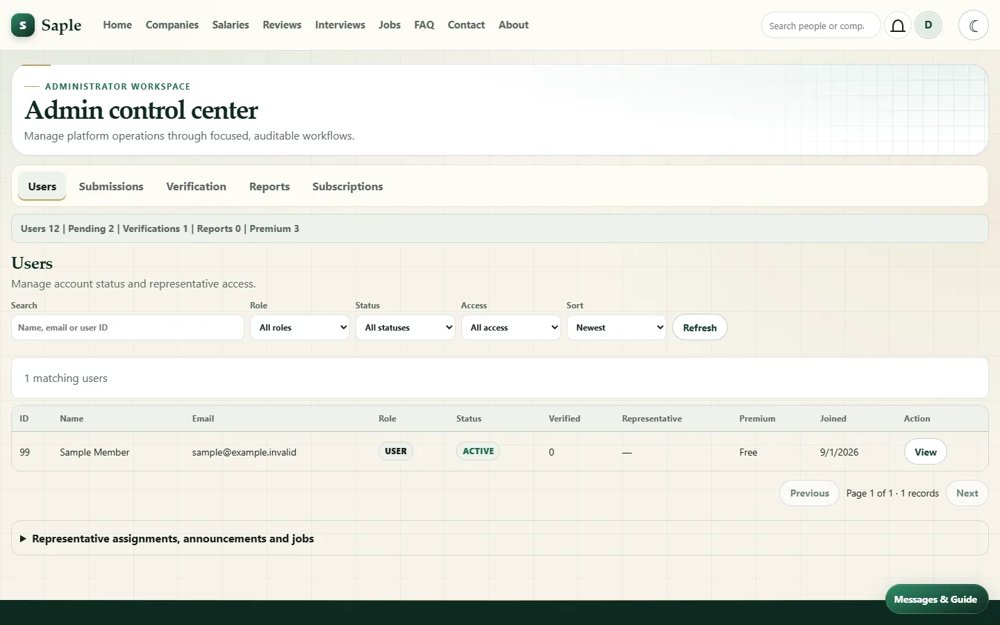

# 🌱 Saple

**Company and career insights you can actually trust.**

Saple brings company profiles, salaries, workplace reviews, interview experiences and job openings into one place, and shows how far each piece of information can be trusted: who verified it, and whether a moderator approved it.

[](https://github.com/mdraihankabirsifat/Saple/actions/workflows/ci.yml)


### 🌐 Live demo: [saple.www-raihankabireusc.workers.dev](https://saple.www-raihankabireusc.workers.dev/)

> **Academic project.** Saple is a BUET CSE216 Database Sessional project. It is not affiliated with, or an official service of, any company it lists, and the people, salaries, reviews and vacancies in the demo data are synthetic.



## Overview

Job seekers usually piece together company information from scattered, unverifiable sources. Saple keeps it in one place and is honest about where each number came from.

Anyone can browse companies, salaries, reviews, interviews and jobs. Employees can contribute, but only for the exact company and role they have been verified for, and nothing becomes public until an administrator approves it. Salaries are shown as two separate ranges: a **Verified** range from verified contributors, and a wider **Community** range from all approved submissions, each with its contribution count.

Around that core, Saple has professional profiles, member and company search, direct messaging, notifications, job applications, company representatives and an AI helper, the Saple Guide.

## Features

<table>
<tr>
<td width="50%" valign="top">

**Career insights**
- Company profiles with ratings and benefits
- Verified and community salary ranges by role
- Moderated workplace reviews and interview experiences
- Jobs published by company representatives, with applications and status tracking

</td>
<td width="50%" valign="top">

**Professional network**
- Public profiles with headline, about, experience, education and skills
- Search for members and companies from any page
- Live company suggestions in the homepage search
- Private direct messages between members

</td>
</tr>
<tr>
<td width="50%" valign="top">

**Trust and verification**
- Employee verification for one company and role at a time
- Nothing is public until an administrator approves it
- Company representatives manage their own companies only
- Reports, and an audited history of every moderation decision

</td>
<td width="50%" valign="top">

**Platform**
- Notifications and site-wide announcements
- Password recovery through a single-use emailed link
- Profile pictures and company logos in Supabase Storage
- Saple Guide: AI help with a built-in fallback
- Responsive light and dark themes with subtle motion

</td>
</tr>
</table>

## Screenshots

### Explore companies and careers

<table>
<tr>
<td width="50%" valign="top">

<br><sub><b>Company directory</b>: search, filter and sort.</sub>
</td>
<td width="50%" valign="top">

<br><sub><b>Company details</b>: verified and community salary ranges.</sub>
</td>
</tr>
</table>

### Search and connect

<table>
<tr>
<td width="50%" valign="top">

<br><sub><b>Homepage search</b>: company suggestions while you type.</sub>
</td>
<td width="50%" valign="top">

<br><sub><b>Global search</b>: people and companies from any page.</sub>
</td>
</tr>
<tr>
<td width="50%" valign="top">

<br><sub><b>Professional profile</b>: experience, education and skills.</sub>
</td>
<td width="50%" valign="top">

<br><sub><b>Messages and Saple Guide</b>: one panel for both.</sub>
</td>
</tr>
</table>

### Work and moderate

<table>
<tr>
<td width="50%" valign="top">

<br><sub><b>Jobs</b>: published vacancies still inside their deadline.</sub>
</td>
<td width="50%" valign="top">

<br><sub><b>Admin moderation</b>: review queue with full submission context.</sub>
</td>
</tr>
</table>

<sub>Public pages were captured from the live site. The profile, messages, jobs, search and admin views use the synthetic demo accounts.</sub>

## Database design

The database is the heart of the project. It runs on **PostgreSQL**, hosted by **Supabase**.

| | |
|---|---|
| Tables | **26**, covering accounts and profiles, verification and representatives, company reference data, contributions and moderation, and jobs and applications |
| Views | **5** public read models, for example approved reviews and salary summaries |
| Keys and constraints | 44 foreign keys, 100 named `CHECK` constraints, unique and partial-unique keys |
| Indexes | 44, including partial and case-insensitive unique indexes |
| Migrations | **8** additive, re-runnable migrations from the original 14-table schema |
| ERD | [`ERD.pdf`](ERD.pdf) and [`docs/ERD.md`](docs/ERD.md), generated from the schema file |

Some design choices worth pointing out:

- **Supertype and subtypes.** `submissions` holds what every contribution shares; `salary_submissions`, `company_reviews` and `interview_experiences` hold the rest, one-to-one on the same key.
- **Many-to-many links** such as `company_benefits` and `user_skills`, with a shared, case-insensitive skill catalogue.
- **Audit tables** (`moderation_actions`, `job_application_status_history`, `representative_assignment_actions`) use `ON DELETE RESTRICT`, so history cannot be deleted by accident.
- **Database-side logic:**
  - a trigger function, `saple_set_updated_at()`, with seven `BEFORE UPDATE` triggers;
  - a statistics function, `saple_company_insight_summary()`, that counts approved data only;
  - a procedure, `saple_apply_application_decision()`, that updates an application and writes its history row together.
- **Explicit transactions.** Every write runs inside `BEGIN … COMMIT`, with `SELECT … FOR UPDATE` where two requests could race.
- **Scoped access.** Every protected request reloads the account's role, status and company scopes from the database, so a revoked permission takes effect on the next click.

Details: [`docs/relational_schema.md`](docs/relational_schema.md) and [`docs/cse216-final-compliance.md`](docs/cse216-final-compliance.md).

## Architecture

```text
Browser  (static pages, strict Content-Security-Policy)
   │
   ▼
Cloudflare Worker  ── serves frontend/ as static assets
   │
   ▼
Express app  (route → controller → service → repository)
   │  parameterized SQL through pg
   ▼
Cloudflare Hyperdrive  (connection pooling)
   │
   ▼
Supabase PostgreSQL
```

Alongside the database:

- **Supabase Storage** holds profile pictures and company logos.
- **SMTP** (Gmail, through Nodemailer) sends password recovery emails.
- **Groq**, or any OpenAI-compatible API, answers Saple Guide questions through the backend.

The backend is written in layers. Routes only map URLs, controllers handle HTTP, services hold the rules and authorization, and repositories are the only place SQL is written, always with `$1`-style parameters and never string-built. The browser never talks to the database or holds a database credential, and authentication is Saple's own (JWT), not Supabase Auth.

## Tech stack

| Layer | Technology |
|-------|------------|
| Frontend | HTML, CSS, vanilla JavaScript modules; no build step, no third-party scripts |
| Backend | Node.js, Express 5 |
| Database | PostgreSQL on Supabase |
| Database connection | `pg`, through Cloudflare Hyperdrive in production |
| Hosting | Cloudflare Workers (static assets and the API) |
| Storage | Supabase Storage |
| Authentication | JWT and bcrypt |
| Email | Nodemailer with Gmail SMTP |
| AI | Groq (OpenAI-compatible API) |

The [`ml/`](ml/) folder is a separate Python prototype that estimates moderation risk for salary submissions. It is not wired into the app.

## Project structure

```text
Saple/
├── backend/            Express API
│   ├── config/         database, auth, storage, mail and AI settings
│   ├── controllers/
│   ├── middleware/     authentication, rate limits, security headers
│   ├── repositories/   all SQL lives here
│   ├── routes/
│   ├── services/
│   └── tests/
├── cloudflare/         Worker entry point
├── database/postgres/  schema, demo data, validation queries, migrations/
├── docs/               setup, deployment, schema and compliance documents
├── frontend/           pages, css/, js/, assets/, service worker
├── ml/                 optional ML prototype
├── assets/screenshots/
├── ERD.pdf
├── render.yaml
└── wrangler.jsonc
```

## Quick start

You need Node.js 22 or newer and a PostgreSQL database, such as a Supabase project.

```bash
git clone https://github.com/mdraihankabirsifat/Saple.git
cd Saple/backend
npm ci
cp .env.example .env    # then set DATABASE_URL and JWT_SECRET
npm start
```

Open <http://localhost:3000>; one Express server serves both the pages and the API. Every setting is described in [`backend/.env.example`](backend/.env.example), and database setup is in [`docs/supabase_setup.md`](docs/supabase_setup.md).

With Docker Desktop running, `npm run local:up --prefix backend` starts the app with its own seeded PostgreSQL, no Supabase needed.

## Deployment

**Production:** Cloudflare Workers, with Hyperdrive in front of Supabase PostgreSQL.
**Live URL:** <https://saple.www-raihankabireusc.workers.dev/>

The same code still runs as a plain Node server locally, in Docker, and on Render through [`render.yaml`](render.yaml), but Render is not the current production host. For an offline demo, the Node server can also fall back to a local PostgreSQL database.

See [`docs/cloudflare-deployment.md`](docs/cloudflare-deployment.md), and [`docs/deployment.md`](docs/deployment.md) for Render.

## Security

- Passwords are stored as bcrypt hashes; sessions use signed JWTs, and logging out revokes the token server-side.
- Password reset links are single-use, expire, and are stored only as hashes.
- Sign-in, recovery, search, messages and the Saple Guide are rate-limited.
- All SQL is parameterized; authorization is checked on the server for every request.
- Pages load no third-party code and run under a strict Content-Security-Policy with security headers; dynamic text is rendered as text, never as HTML.
- Secrets live in environment variables and Cloudflare secrets, never in the frontend or the repository.

More in [`docs/security-and-safe-deployment.md`](docs/security-and-safe-deployment.md).

## Testing

```bash
npm test --prefix backend    # unit, HTTP and database tests (PGlite); no external database needed
npm run cf:dry-run           # builds the Cloudflare Worker bundle without deploying
```

GitHub Actions runs the backend suite, the ML tests and a set of security checks on every push.

## Documentation

- [`docs/cse216-final-compliance.md`](docs/cse216-final-compliance.md): course requirements mapped to code, database objects and tests
- [`docs/relational_schema.md`](docs/relational_schema.md) and [`docs/ERD.md`](docs/ERD.md): tables, constraints and relationships
- [`docs/requirement_analysis.md`](docs/requirement_analysis.md): requirements and scope
- [`docs/supabase_setup.md`](docs/supabase_setup.md) and [`database/postgres/migrations/README.md`](database/postgres/migrations/README.md): database setup and migrations
- [`docs/cloudflare-deployment.md`](docs/cloudflare-deployment.md) and [`docs/deployment.md`](docs/deployment.md): hosting
- [`docs/ai-assistant-setup.md`](docs/ai-assistant-setup.md) and [`docs/email-setup-and-test.md`](docs/email-setup-and-test.md): Saple Guide and email
- [`backend/README.md`](backend/README.md) and [`frontend/README.md`](frontend/README.md): API and frontend details

## License

This repository has no open-source license. Saple is an independent BUET CSE academic project and is not an official service of any company it lists.
