# Saple ERD (PostgreSQL)

<!-- Generated by docs/tools/build-erd.js from database/postgres/01_final_schema_postgres.sql. Do not edit by hand. -->

The active schema has **21 tables and 5 views**. This diagram is generated from the
schema file, so it always matches it. A printable version is [ERD.html](ERD.html) and
`ERD.pdf` at the repository root. The Oracle 19c milestone diagram is kept in
[archive/](archive/).

Actor columns that only record *who acted* (`reviewed_by`, `approved_by`, `revoked_by`,
`resolved_by`, `moderator_user_id`, `actor_user_id`, `created_by`, `created_by_user_id`)
reference `users`; they are listed in each entity but omitted as relationship lines.

```mermaid
erDiagram
    USERS ||--o| EMPLOYEES : "user_id"
    USERS ||--o{ PASSWORD_RESET_TOKENS : "user_id"
    COMPANIES ||--o{ COMPANY_BENEFITS : "company_id"
    BENEFITS ||--o{ COMPANY_BENEFITS : "benefit_id"
    EMPLOYEES ||--o{ EMPLOYMENT_VERIFICATIONS : "employee_id"
    COMPANIES ||--o{ EMPLOYMENT_VERIFICATIONS : "company_id"
    JOB_ROLES |o--o{ EMPLOYMENT_VERIFICATIONS : "role_id"
    USERS ||--o{ SUBMISSIONS : "user_id"
    COMPANIES ||--o{ SUBMISSIONS : "company_id"
    SUBMISSIONS ||--o| SALARY_SUBMISSIONS : "submission_id"
    JOB_ROLES ||--o{ SALARY_SUBMISSIONS : "role_id"
    SUBMISSIONS ||--o| COMPANY_REVIEWS : "submission_id"
    JOB_ROLES |o--o{ COMPANY_REVIEWS : "role_id"
    SUBMISSIONS ||--o| INTERVIEW_EXPERIENCES : "submission_id"
    JOB_ROLES ||--o{ INTERVIEW_EXPERIENCES : "role_id"
    USERS ||--o{ REPORTS : "reporter_user_id"
    SUBMISSIONS ||--o{ REPORTS : "submission_id"
    SUBMISSIONS ||--o{ MODERATION_ACTIONS : "submission_id"
    USERS ||--o{ COMPANY_REPRESENTATIVES : "user_id"
    COMPANIES ||--o{ COMPANY_REPRESENTATIVES : "company_id"
    COMPANY_REPRESENTATIVES ||--o{ REPRESENTATIVE_ASSIGNMENT_ACTIONS : "assignment_id"
    COMPANIES ||--o{ JOB_POSTINGS : "company_id"
    COMPANY_REPRESENTATIVES |o--o{ JOB_POSTINGS : "created_by_assignment_id"
    JOB_ROLES |o--o{ JOB_POSTINGS : "role_id"
    JOB_POSTINGS ||--o{ JOB_APPLICATIONS : "job_id"
    USERS ||--o{ JOB_APPLICATIONS : "applicant_user_id"
    JOB_APPLICATIONS ||--o{ JOB_APPLICATION_STATUS_HISTORY : "application_id"
    USERS ||--o{ NOTIFICATIONS : "user_id"
    USERS {
        bigint user_id PK
        varchar full_name
        varchar email UK
        varchar password_hash
        varchar user_type
        varchar account_role
        varchar account_status
        integer token_version
        timestamptz created_at
        timestamptz updated_at
    }
    EMPLOYEES {
        bigint employee_id PK
        bigint user_id FK,UK
        varchar employment_status
        timestamptz created_at
    }
    PASSWORD_RESET_TOKENS {
        bigint reset_token_id PK
        bigint user_id FK
        varchar token_hash UK
        timestamptz expires_at
        timestamptz used_at
        timestamptz revoked_at
        timestamptz created_at
    }
    COMPANIES {
        bigint company_id PK
        varchar company_name UK
        varchar industry
        varchar headquarters_city
        varchar country
        varchar website
        varchar company_size
        text description
        timestamptz created_at
        timestamptz updated_at
    }
    JOB_ROLES {
        bigint role_id PK
        varchar role_name UK
        varchar role_category
        varchar description
    }
    BENEFITS {
        bigint benefit_id PK
        varchar benefit_name UK
        varchar benefit_category
        varchar description
    }
    COMPANY_BENEFITS {
        bigint company_id PK,FK
        bigint benefit_id PK,FK
        varchar details
        varchar eligibility
        timestamptz last_updated
    }
    EMPLOYMENT_VERIFICATIONS {
        bigint verification_id PK
        bigint employee_id FK
        bigint company_id FK
        bigint role_id FK
        varchar verification_method
        varchar company_email
        varchar proof_type
        varchar proof_reference
        varchar verification_status
        timestamptz requested_at
        timestamptz reviewed_at
        timestamptz expires_at
        varchar rejection_reason
        bigint reviewed_by FK
    }
    SUBMISSIONS {
        bigint submission_id PK
        bigint user_id FK
        bigint company_id FK
        varchar submission_type
        integer is_anonymous
        varchar submission_status
        varchar verification_status
        timestamptz submitted_at
        timestamptz approved_at
        timestamptz updated_at
    }
    SALARY_SUBMISSIONS {
        bigint submission_id PK,FK
        bigint role_id FK
        numeric base_salary
        numeric additional_compensation
        varchar currency
        varchar pay_period
        numeric years_of_experience
        varchar employment_type
        varchar work_mode
        integer salary_year
    }
    COMPANY_REVIEWS {
        bigint submission_id PK,FK
        bigint role_id FK
        varchar review_title
        numeric overall_rating
        numeric work_life_balance_rating
        numeric career_growth_rating
        numeric management_rating
        numeric culture_rating
        text pros
        text cons
        text advice_to_management
        varchar employment_status
        date review_date
    }
    INTERVIEW_EXPERIENCES {
        bigint submission_id PK,FK
        bigint role_id FK
        date interview_date
        varchar difficulty_level
        integer rounds_count
        varchar interview_mode
        varchar result_status
        integer duration_days
        text process_description
        text questions_summary
    }
    REPORTS {
        bigint report_id PK
        bigint reporter_user_id FK,UK
        bigint submission_id FK,UK
        varchar reason_category
        varchar report_description
        varchar report_status
        timestamptz reported_at
        timestamptz resolved_at
        varchar resolution_note
        bigint resolved_by FK
    }
    MODERATION_ACTIONS {
        bigint action_id PK
        bigint submission_id FK
        bigint moderator_user_id FK
        varchar action_type
        varchar previous_status
        varchar new_status
        varchar action_note
        timestamptz action_at
    }
    COMPANY_REPRESENTATIVES {
        bigint assignment_id PK
        bigint user_id FK,UK
        bigint company_id FK,UK
        varchar job_title
        varchar assignment_status
        varchar request_note
        varchar decision_note
        bigint approved_by FK
        timestamptz approved_at
        bigint revoked_by FK
        timestamptz revoked_at
        timestamptz created_at
        timestamptz updated_at
    }
    REPRESENTATIVE_ASSIGNMENT_ACTIONS {
        bigint action_id PK
        bigint assignment_id FK
        bigint actor_user_id FK
        varchar action_type
        varchar previous_status
        varchar new_status
        varchar action_note
        timestamptz action_at
    }
    JOB_POSTINGS {
        bigint job_id PK
        bigint company_id FK
        bigint created_by_user_id FK
        bigint created_by_assignment_id FK
        bigint role_id FK
        varchar title
        text description
        text requirements
        varchar location
        varchar employment_type
        varchar work_mode
        numeric salary_min
        numeric salary_max
        varchar salary_currency
        varchar salary_period
        date application_deadline
        varchar job_status
        timestamptz published_at
        timestamptz closed_at
        timestamptz created_at
        timestamptz updated_at
    }
    JOB_APPLICATIONS {
        bigint application_id PK
        bigint job_id FK,UK
        bigint applicant_user_id FK,UK
        text cover_letter
        varchar application_status
        timestamptz submitted_at
        timestamptz updated_at
        bigint reviewed_by FK
        timestamptz reviewed_at
    }
    JOB_APPLICATION_STATUS_HISTORY {
        bigint history_id PK
        bigint application_id FK
        bigint actor_user_id FK
        varchar previous_status
        varchar new_status
        varchar action_note
        timestamptz action_at
    }
    ANNOUNCEMENTS {
        bigint announcement_id PK
        varchar title
        varchar message
        varchar severity
        boolean is_dismissible
        boolean is_active
        timestamptz starts_at
        timestamptz ends_at
        bigint created_by FK
        timestamptz created_at
        timestamptz updated_at
    }
    NOTIFICATIONS {
        bigint notification_id PK
        bigint user_id FK
        varchar notification_type
        varchar title
        varchar message
        varchar related_entity_type
        bigint related_entity_id
        timestamptz read_at
        timestamptz created_at
    }
```



## Relationships

| Parent | Child column | Cardinality | On delete |
|--------|--------------|-------------|-----------|
| users | employees.user_id | 1 : 0..1 | CASCADE |
| users | password_reset_tokens.user_id | 1 : 0..* | CASCADE |
| companies | company_benefits.company_id | 1 : 0..* | CASCADE |
| benefits | company_benefits.benefit_id | 1 : 0..* | CASCADE |
| employees | employment_verifications.employee_id | 1 : 0..* | CASCADE |
| companies | employment_verifications.company_id | 1 : 0..* | CASCADE |
| job_roles | employment_verifications.role_id | 1 : 0..* (optional) | NO ACTION |
| users | employment_verifications.reviewed_by (actor) | 1 : 0..* (optional) | NO ACTION |
| users | submissions.user_id | 1 : 0..* | NO ACTION |
| companies | submissions.company_id | 1 : 0..* | NO ACTION |
| submissions | salary_submissions.submission_id | 1 : 0..1 | CASCADE |
| job_roles | salary_submissions.role_id | 1 : 0..* | NO ACTION |
| submissions | company_reviews.submission_id | 1 : 0..1 | CASCADE |
| job_roles | company_reviews.role_id | 1 : 0..* (optional) | NO ACTION |
| submissions | interview_experiences.submission_id | 1 : 0..1 | CASCADE |
| job_roles | interview_experiences.role_id | 1 : 0..* | NO ACTION |
| users | reports.reporter_user_id | 1 : 0..* | NO ACTION |
| submissions | reports.submission_id | 1 : 0..* | CASCADE |
| users | reports.resolved_by (actor) | 1 : 0..* (optional) | NO ACTION |
| submissions | moderation_actions.submission_id | 1 : 0..* | CASCADE |
| users | moderation_actions.moderator_user_id (actor) | 1 : 0..* | NO ACTION |
| users | company_representatives.user_id | 1 : 0..* | CASCADE |
| companies | company_representatives.company_id | 1 : 0..* | RESTRICT |
| users | company_representatives.approved_by (actor) | 1 : 0..* (optional) | NO ACTION |
| users | company_representatives.revoked_by (actor) | 1 : 0..* (optional) | NO ACTION |
| company_representatives | representative_assignment_actions.assignment_id | 1 : 0..* | RESTRICT |
| users | representative_assignment_actions.actor_user_id (actor) | 1 : 0..* | NO ACTION |
| companies | job_postings.company_id | 1 : 0..* | RESTRICT |
| users | job_postings.created_by_user_id (actor) | 1 : 0..* | NO ACTION |
| company_representatives | job_postings.created_by_assignment_id | 1 : 0..* (optional) | SET NULL |
| job_roles | job_postings.role_id | 1 : 0..* (optional) | NO ACTION |
| job_postings | job_applications.job_id | 1 : 0..* | RESTRICT |
| users | job_applications.applicant_user_id | 1 : 0..* | NO ACTION |
| users | job_applications.reviewed_by (actor) | 1 : 0..* (optional) | NO ACTION |
| job_applications | job_application_status_history.application_id | 1 : 0..* | RESTRICT |
| users | job_application_status_history.actor_user_id (actor) | 1 : 0..* | NO ACTION |
| users | announcements.created_by (actor) | 1 : 0..* | NO ACTION |
| users | notifications.user_id | 1 : 0..* | CASCADE |

## Partial unique rules

- `company_representatives`: (user_id, company_id) unique where assignment_status IN ('PENDING', 'ACTIVE')

## Views

- `vw_public_companies` — reads `companies`
- `vw_public_approved_reviews` — reads `submissions`, `company_reviews`, `companies`, `job_roles`
- `vw_verified_salary_summary` — reads `submissions`, `salary_submissions`, `companies`, `job_roles`
- `vw_community_salary_summary` — reads `submissions`, `salary_submissions`, `companies`, `job_roles`
- `vw_public_open_jobs` — reads `job_postings`, `companies`, `job_roles`

## Regenerating

```
node docs/tools/build-erd.js
```

Then print `docs/ERD.html` to `ERD.pdf` from any Chromium browser, or headlessly:

```
msedge --headless --disable-gpu --no-pdf-header-footer --print-to-pdf=ERD.pdf docs/ERD.html
```
